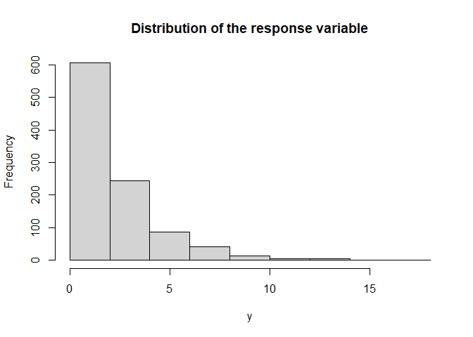
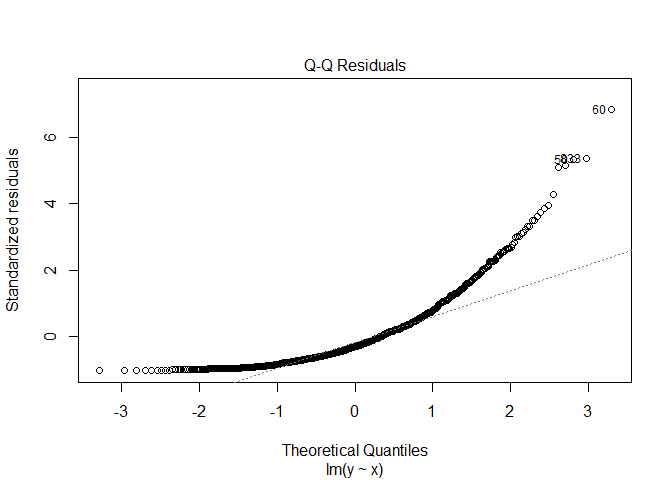
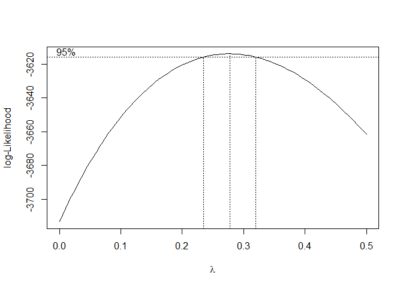

Box-Cox Transformation
================


The Box Cox transformation may be useful to transform a skewed
distribution into a more symmetrical one.

This transformation corrects :

- non-normality on the residuals distribution

- non-constant variance of the residuals (heteroscedasticity)

This is a power transformation performed on the response variable $y$.

**The Box Cox method works only if the response variable takes positive
values. Otherwise, a pre-transformation of the data is needed such as
adding an appropriately positive number to all observations.**

The transformations applied on y are as follow :

- $\lambda =0$ then $y' = ln(y)$

- $\lambda \neq 0$ then $y' = \frac{y^\lambda-1}{\lambda}$

When the distribution of the response variable y becomes more
symmetrical, it may lead to residuals that exhibit homoscedasticity.

Then , the idea is to find the suitable power by lambda $\lambda$ on y.

``` r
  #Load data
data <- read.csv("C:/Users/USER/Desktop/IIT/data_bc.csv")
```

``` r
hist(data$y,
     xlab = "y",
     main = "Distribution of the response variable")
```

<!-- -->

As we can see, the dependent variable is right-skewed.

Let us set up a linear regression model and check out the distribution
of the error terms.

``` r
model <- lm (y~x, data = data)
plot(model, which = 2)
```

<!-- -->

The y axis represents the scaled residuals (with a standard deviation
equals to 1 and mean 0), and the x axis represents the theoretical
quantiles if the data are normally distributed.

If most of the data follow the same pattern as the theoretical
quantiles, so that the scatter is on the dotted line, then the
standardized residuals and the normal distribution have comparable
quantiles.

**For instance, the actual residuals do not increase at the same rate as
the theoretical quantiles, thus the error terms are not normally
distributed.**

### Box-Cox Transformation

The Box-Cox plot typically represents the log-likelihood function for
different values of $\lambda$ and allows to identify the optimal
$\lambda$ that maximizes the log-likelihood.

We assume that the transformed data $y(\lambda)$ in the Box-Cox
log-likelihood function is normally distributed.

The probability density distribution of a normal distribution is given
by :

$$
f(x) = \frac {1}{\sqrt{\sigma^22\pi}} e^{\frac{-1}{2}\frac{(x-\mu)^2}{\sigma^2}}
$$

The likelihood function for the transformed $y$ under the normality
assumption is :

$$
L(\bar{y'}, \sigma^2 \mid y_1', y_2',\dots, y_n') = \prod_{i=1}^n \frac {1}{\sqrt{\sigma^22\pi}}e^{\frac{-1}{2}\frac{(y_i'-\bar{y'})^2}{\sigma^2}}
$$

The log likelihood is given by :

$$
log L(\bar{y'}, \sigma^2 \mid y_1', y_2',\dots, y_n') = \Sigma_{i=1}^n log(\frac {1}{\sqrt{\sigma^22\pi}})+\Sigma_{i=1}^n log (e^{\frac{-1}{2}\frac{(y_i'-\bar{y'})^2}{\sigma^2}})
$$

Then we get,

$$
log L(\bar{y'}, \sigma^2 \mid y_1', y_2',\dots, y_n') = -\frac{n}{2}\log (\sigma^2) -\frac{n}{2} log(2\pi) -(\frac{(\Sigma_{i=1}^ny_i'-\bar{y'})^2}{2\sigma^2})
$$

We know that the variance
$\sigma^2 = \frac{\Sigma_{i=1}^n(y_i'-\bar{y'})^2}{n}$

Substituting this into the log-likelihood function, we get :

$$
log L(\bar{y'}, \sigma^2 \mid y_1', y_2',\dots, y_n') = -\frac{n}{2}log {\frac{\Sigma_{i=1}^n(y_i'-\bar{y'})^2}{n}} -\frac{n}{2} log2\pi -\frac{n}{2}
$$

Since we are maximizing the log-likelihood with respect to $\lambda$ (
with $y_i'=y_i^\lambda$ ), the term $-\frac{n}{2} log2\pi -\frac{n}{2}$
is a constant and can be ignored.

Thus , the log-likelihood is given by :

$$
log L(\bar{y'}, \sigma^2 \mid y_1', y_2',\dots, y_n') = -\frac{n}{2}log {\frac{\Sigma_{i=1}^n(y_i'-\bar{y'})^2}{n}} 
$$

In the context of transformations, we include the Jacobian which is a
determinant that provides a scaling factor necessary for transforming
variables in probability density functions.

To calculate the Jacobian, we need to find the derivative of $y_i'$ with
respect to $y_i$:

Given $y_i' = \frac{y_i^\lambda-1}{\lambda}$ for $\lambda \neq 0$
Therefore , the Jacobian determinant is :

$$
J = \prod_{i=1}^n \mid \frac{dy_i'}{dy_i}\mid = \prod_{i=1}^n\mid y_i^{\lambda-1}\mid 
$$

Taking the natural logarithm of the Jacobian determinant, we get :

$$
log J = (\lambda-1)\Sigma_{i=1}^n y_i
$$

Combining the log-likelihood of the transformed data and the log of the
Jacobian determinant , we get :

$$
log L(\lambda \mid y_1', y_2',\dots, y_n') = -\frac{n}{2}log \frac{\Sigma_{i=1}^n(y_i'-\bar{y'})^2}{n}+ (\lambda-1)\Sigma_{i=1}^ny_i
$$

*The maximum log-likelihood is found by taking the derivative of the
log-likelihood below with respect to $\lambda$ and setting this
derivative equal to 0.*

We are going to plot the log-likelihood of $\lambda$ in order to find
out the optimal value of $\lambda$

``` r
library(MASS)
```

``` r
bc <- boxcox(model, seq(0,0.5,0.01))
```

<!-- -->

The best estimation of $\lambda$ falls between the interval \[0.2,0.4\]

We will apply the Box-Cox transformation to y using different values of
$\lambda$ close to its optimal estimate

``` r
  #Define a function that transforms y and set up a model 

fit_model_bc <- function(x,y) {
  y_bc1 <- ((y^(0.2))-1)/0.2
  y_bc2 <- ((y^(0.3))-1)/0.3


  y_bc_trans_list <- list(y_bc1, y_bc2)
  bc_trans_labels <- c("lambda = 0.2", "lambda = 0.3")

  for (i in 1:length(y_bc_trans_list)){
  
  #Set up linear regression model
  model_bc <- lm(y_bc_trans_list[[i]]~x)
  
  #visualize QQ plots
  plot(model_bc, which = 2, main = paste("QQ plot -", bc_trans_labels[i]))
  
  
  #Distribution of y 
  hist(y_bc_trans_list[[i]],
       xlab = paste("y transformed with ",bc_trans_labels[i]),
       main = paste("Distribution of y with ", bc_trans_labels[i]))
}}
```

``` r
par(mfrow=c(2,2))
fit_model_bc(data$x,data$y)
```

<!-- -->

For $\lambda = 0.2$ and $\lambda = 0.3$ , we can see through these plots
that the transformations applied on y effectively address the non
normality of the error terms.
