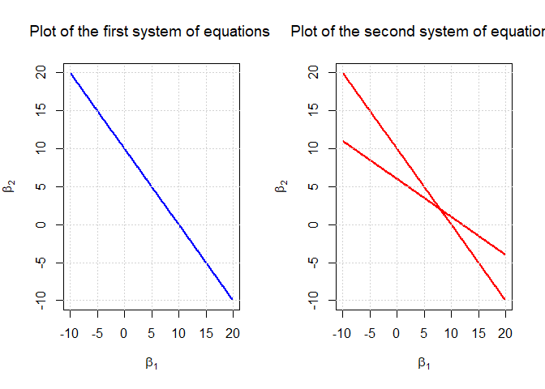
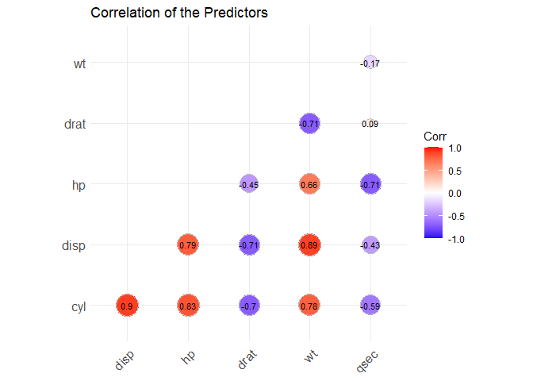
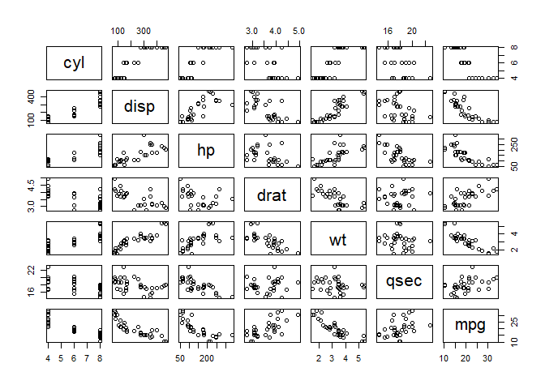
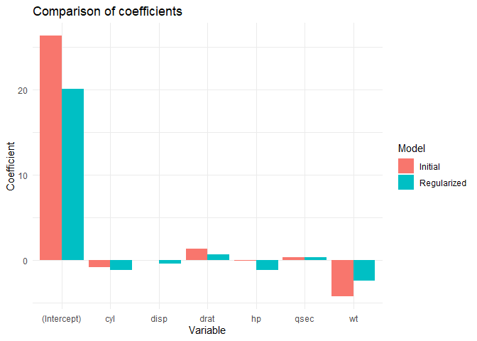

Multicollinearity - Ridge Regression
================

One of the key assumptions in Linear Regression is that there should be
no correlation between the independent variables.

Here are some examples of correlated independent variables:

- the height and the weight (positive correlation)

- the number of hours worked and amount of free time (negative
  correlation)

- the distance traveled and the amount of fuel consumed (positive
  correlation)

Now, let us delve into the effects of multicollinearity.

***EFFECT OF MULTICOLLINEARITY ON THE ESTIMATION OF THE PARAMETERS***

Suppose the system of equations with the independent variables
$x_{i1} , x_{i2}$ and the dependent variable $y_i$. $\beta_1$ and
$\beta_2$ are the unknown parameters:

$$
y_1 = \beta_1 x_{11} + \beta_2 x_{12}
$$

$$
y_2 = \beta_1 x_{21} + \beta_2 x_{22}
$$

- Consider this first system of equations with 2 observations :

$$
10 = \beta_1 +\beta_2 
$$

$$
20 = 2\beta_1 +2\beta_2
$$

- And this second system of equations with 2 observations :

$$
10 = \beta_1 +\beta_2 
$$

$$
12 = \beta_1 +2\beta_2
$$

Let us solve those systems and visualize the possible solutions for
$\beta_1$ and $\beta_2$ derived from each system :

``` r
  #Define a range for beta_1 from the first system
beta_1 <- seq(-10,20,by = 0.1)
  #Compute beta_2 from the first system
beta_2_1 <- 10 - beta_1
beta_2_2 <- (20 - 2*beta_1)/2

  #Define a range for beta_1 from the first system
b_1 <- seq(-10,20,by = 0.1)
  #Compute beta_2 from the second system
b_2_1 <- 10 - b_1
b_2_2 <- (12-b_1)/2

par(mfrow=c(1,2))


  #Plot the first system 
      #first equation
plot(beta_1,beta_2_1, type = "l", col = "blue", lwd = 2,
     xlab = expression(beta[1]), ylab = expression(beta[2]), 
     main = expression(paste("Plot of the first system of equations ")))
      #second equation
lines(beta_1, beta_2_2, col = "blue", lwd = 2)
grid()

  #Plot the second system 
      #first equation
plot(b_1,b_2_1, type = "l", col = "red", lwd = 2,
     xlab = expression(beta[1]), ylab = expression(beta[2]), 
     main = expression(paste("Plot of the second system of equations")))
      #second equation
lines(b_1, b_2_2, col = "red", lwd = 2)
grid()
```

<!-- -->

- For the first system :

$$
10 = \beta_1 +\beta_2 
$$

$$
20 = 2\beta_1 +2\beta_2
$$

While the second equation is redundant (specifically the second equation
is the first equation multiplied by 2), the solutions of those 2
equations are represented by the blue line. Every point on this line is
a possible solution, indicating that there are infinitely many
combinations of the parameters $\beta_1$ and $\beta_2$ that satisfy this
system of equations.

Additionally, instead of having two independent equations to uniquely
determine $\beta_1$ and $\beta_2$ , we effectively have only one
equation $10 = \beta_1 +\beta_2$ as the second equation does not provide
any new information.

- For the second system :

$$
10 = \beta_1 +\beta_2 
$$

$$
12 = \beta_1 +2\beta_2
$$

The two red lines represent the two equations from this system. The
solution is the intersection point of the two lines. This intersection
is the only combination of $\beta_1$ and $\beta_2$ that simultaneously
satisfies both equations, providing a unique solution.

*Notice that if the equations derived from observations are correlated,
it suggests that the independent variables themselves* ( $x_{i1}$ and
$x_{i2}$ ) *are linearly dependent*

**Conclusion**

The main difference between those two systems of equations is that on
the first one there is multicollinearity, then multicollinearity leads
to a vastly different estimates of the model parameters.

***EFFECT OF MULTICOLLINEARITY ON THE VARIANCE OF THE PARAMETERS***

Consider a multiple regression model $y = X\beta+\varepsilon$

Let us express the variance $Var(\hat{\beta})$ as a function of the
correlation coefficient $r$ between the regressors.

The estimation of the $Var(\hat{\beta})$ is as follow :

$$
Var(\hat{\beta}) = \sigma^2(X^tX)^{-1}
$$

Suppose we only have the regressors $x_1$ and $x_2$, we get the
following matrix of the regressors :

$$ 
X =
\begin{pmatrix}
x_{11} & x_{12} \\
x_{21} & x_{22}
\end{pmatrix}
$$

The correlation between $x_1$ and $x_2$ is given by :

$$
r = \frac{\Sigma_{i=1}^2(x_{i1}-\bar{x_{1}})(x_{i2}-\bar{x_{2}})}{\sqrt{\Sigma_{i=1}^2(x_{i1}-\bar{x_{1}})^2\Sigma_{i=1}^2(x_{i2}-\bar{x_{2}})^2}}
$$

$x_1$ and $x_2$ are scaled to unit length, that is :

$$
\bar{x_1} = \bar{x_2} = 0 \\
x_{11}^2 + x_{21}^2 = 1 \\
x_{12}^2 + x_{22}^2 = 1
$$

hence ,

$$
r = \frac{\Sigma_{i=1}^2x_{i1}x_{i2}}{\sqrt{\Sigma_{i=1}^2x_{i1}^2\Sigma_{i=1}^2x_{i2}^2}}
$$

and

$$
\Sigma_{i=1}^2x_{i1}x_{i2} = x_{11}x_{12} + x_{21}x_{22} \\
\Sigma_{i=1}^2x_{i1}^2 = x_{11}^2 + x_{21}^2 =1 \\
\Sigma_{i=1}^2x_{i2}^2 = x_{12}^2 + x_{22}^2 =1
$$

Then we get :

$$
r = x_{11}x_{12} + x_{21}x_{22}
$$

Recall the estimation of the variance of the parameters :

$$
Var(\hat{\beta}) = \sigma^2(X^tX)^{-1}
$$

And

$$ 
X^t =
\begin{pmatrix}
x_{11} & x_{21} \\
x_{12} & x_{22}
\end{pmatrix}
X =
\begin{pmatrix}
x_{11} & x_{12} \\
x_{21} & x_{22}
\end{pmatrix}
$$

$$
X^tX =
\begin{pmatrix}
1 & r \\
r & 1
\end{pmatrix}
$$

$$
det(X^tX) =  1 - r^2
$$

thus ,

$$
Var(\hat{\beta}) = \sigma^2 \frac{1}{1-r^2} \begin{pmatrix}
1 & r \\
r & 1
\end{pmatrix}
$$

To find the variances of $Var(\hat{\beta_1})$ and $Var(\hat{\beta_2})$ ,
we look at the diagonal elements of the variance-covariance matrix
below. These diagonal elements represent the variances of the individual
estimated coefficients :

$$
Var(\hat{\beta_1}) = Var(\hat{\beta_2}) = \frac{\sigma^2 }{1-r^2} 
$$

**Conclusion**

We know that there is a strong correlation when the correlation
coefficient $r$ is close to 1 or -1, thus when the correlation
coefficient $r$ between $x_1$ and $x_2$ is close to 1, the variances
$Var(\hat{\beta_1})$ and $Var(\hat{\beta_2})$ will tend to infinity.

Therefore, we can conclude a strong correlation between the variables
will inflate the variance of the parameter estimates, making them
unstable and less reliable.

## How to detect multicollinearity :

### The correlation coefficient

We are going to load the mtcars data set to show an example of
multicollinearity and how to deal with.

``` r
data <- data.frame(mtcars)
```

Format :

A data frame with 32 observations on 11 (numeric) variables.

\[, 1\] mpg Miles/(US) gallon

\[, 2\] cyl Number of cylinders

\[, 3\] disp Displacement (cu.in.)

\[, 4\] hp Gross horsepower

\[, 5\] drat Rear axle ratio

\[, 6\] wt Weight (1000 lbs)

\[, 7\] qsec 1/4 mile time

\[, 8\] vs Engine (0 = V-shaped, 1 = straight)

\[, 9\] am Transmission (0 = automatic, 1 = manual)

\[,10\] gear Number of forward gears

\[,11\] carb Number of carburetors

``` r
  #Set up the model
model <- lm(mpg ~ cyl+disp+hp+drat+wt+qsec, data = data)
summary(model)
```

    ## 
    ## Call:
    ## lm(formula = mpg ~ cyl + disp + hp + drat + wt + qsec, data = data)
    ## 
    ## Residuals:
    ##     Min      1Q  Median      3Q     Max 
    ## -3.9682 -1.5795 -0.4353  1.1662  5.5272 
    ## 
    ## Coefficients:
    ##             Estimate Std. Error t value Pr(>|t|)   
    ## (Intercept) 26.30736   14.62994   1.798  0.08424 . 
    ## cyl         -0.81856    0.81156  -1.009  0.32282   
    ## disp         0.01320    0.01204   1.097  0.28307   
    ## hp          -0.01793    0.01551  -1.156  0.25846   
    ## drat         1.32041    1.47948   0.892  0.38065   
    ## wt          -4.19083    1.25791  -3.332  0.00269 **
    ## qsec         0.40146    0.51658   0.777  0.44436   
    ## ---
    ## Signif. codes:  0 '***' 0.001 '**' 0.01 '*' 0.05 '.' 0.1 ' ' 1
    ## 
    ## Residual standard error: 2.557 on 25 degrees of freedom
    ## Multiple R-squared:  0.8548, Adjusted R-squared:   0.82 
    ## F-statistic: 24.53 on 6 and 25 DF,  p-value: 2.45e-09

We can interpret the significance of each variable as follow :

    significance code         p-value

     ***                 [0, 0.001]

      **              (0.001, 0.01]

       *               (0.01, 0.05]
     
       .                (0.05, 0.1]
     
                           (0.1, 1]
                         
                         

A low p-value indicates that we should reject the null hypothesis
$H_0 : \beta_k =0$ , suggesting that the coefficient $\beta_k$ for the
variable $x_k$ is likely different from zero. Therefore, we have
sufficient evidence to consider $x_k$ as a significant variable in the
model.

We can conclude from the summary of our current model that the weight
(wt) is the only significant variable.

Let us check for multicollinearity

``` r
  #Correlation matrix
cor_matrix <- cor(data[c("cyl", "disp", "hp", "drat", "wt", "qsec")])
library(ggcorrplot)
ggcorrplot(cor_matrix, method = "circle", type = "lower", lab = TRUE, lab_size=3, title = "Correlation of the Predictors")
```

<!-- -->

The plot below is the visualization of the following correlation matrix
:

``` r
cor_matrix
```

    ##             cyl       disp         hp        drat         wt        qsec
    ## cyl   1.0000000  0.9020329  0.8324475 -0.69993811  0.7824958 -0.59124207
    ## disp  0.9020329  1.0000000  0.7909486 -0.71021393  0.8879799 -0.43369788
    ## hp    0.8324475  0.7909486  1.0000000 -0.44875912  0.6587479 -0.70822339
    ## drat -0.6999381 -0.7102139 -0.4487591  1.00000000 -0.7124406  0.09120476
    ## wt    0.7824958  0.8879799  0.6587479 -0.71244065  1.0000000 -0.17471588
    ## qsec -0.5912421 -0.4336979 -0.7082234  0.09120476 -0.1747159  1.00000000

The correlation coefficient is comprised between -1 and 1.

There is a strong positive correlation when the correlation coefficient
is close to 1 and there is a strong negative correlation when the
coefficient is close to -1.

For instance, the variables “disp” (Displacement) and “cyl”(Number of
cylinders) are highly correlated, while “qsec”(1/4 mile time) and
“drat”(Rear axle ratio) are not correlated…

To visualize the trend of a variable against another one, we can use the
plot() function

``` r
library(tidyverse)
data1 <- data %>% 
  select("cyl","disp","hp","drat","wt","qsec","mpg")

plot(data1) 
```

<!-- -->

We can see that some variables show a particular pattern. For instance,
the variable “disp” seems to increase with the variable “hp”, while
“drat” decrease when “wt” increases… When there is no clear pattern,
there is likely no correlation.  
A scatter plot exhibiting a clear pattern and a correlation coefficient
close to -1 or +1 suggest that there is a relationship between the 2
compared variables.

The scatter plot and the covariance matrix are both bivariate method
that compares the dependency of one variable to one another We can try
another way to check out the correlation between each variable, such as
using the R squared and the Variance Inflation Factors (VIF)

### The coefficient of determination

Given the regression model $y_i = \beta_0+\beta_1+\varepsilon_i$ , the
$R^2$ represents the proportion of the total variance in the dependent
variable that is predictable from the dependent variable. $R^2$
describes how well is the fit between the dependent and the independent
variables.

The $R^2$ is calculated by dividing the residuals sum of squares by the
total sum of squares, then subtracting from 1.

The $RSS$ (Residual Sum of Squares) is the difference between the
observed values and the predicted values from the regression model.

$$
RSS = \Sigma_{i=1}^n (y_i-\hat{y_i})^2
$$

The $TSS$ (Total Sum of Squares) is the difference between the observed
values and the mean of the observed values.

$$
TSS = \Sigma_{i=1}^n (y_i-\bar{y_i})^2
$$

Then we can calculate the $R^2$ as follow:

$$
R^2 = 1 - \frac{RSS}{TSS}
$$

In the context of multicollinearity, the intuition behind the use of the
coefficient of determination is that the process is similar to setting
up a linear regression model with a regressor $x_j$ (instead of the
response $y$) as the dependent variable, then the remaining regressors
will be the independent variables.

$$
x_j \sim x_1+x_2+...+x_{j-1}+x_{j+1}+...+ x_k
$$

And we get the model :

$$
x_j = \alpha_0+\alpha_1x_1+\alpha_2x_2+...+\alpha_{j-1}x_{j-1}+\alpha_{j+1}x_{j+1}+...+ \alpha_{k}x_k + \varepsilon
$$

$\alpha$ are the parameters and $\varepsilon$ is the error term.

For $n$ observations and $k$ variables, the $R^2$ of each variable is
given by :

$$
R^2 = 1- \frac {\Sigma_{j=1}^k\Sigma_{i=1}^n (x_{ij}-\hat{x_{ij}})^2} {\Sigma_{j=1}^k\Sigma_{i=1}^n (x_{ij}-\bar{x_{ij}})^2}
$$

When $R^2$ is close to 1 and the residuals sum of squares approach 0,
then the dependent variable clearly show a strong relationship with the
remaining variables.

This suggests that there is multicollinearity of the regressors in the
model.

Using the coefficient of determination implies that we need to find the
$R^2$ of each variable and compare them.

Instead, we can define the variable inflation factors of the predictors.

The Variance Inflation Factors (VIF) is a measure of the amount of
correlation between variables in a multiple regression model. It is
given by :

$$
VIF_j = \frac{1}{1-R_j^2} , j = 1,..., k
$$

When the $R^2$ tends to 1, VIF will be large and the larger the factors
are, the more worry we should be about the presence of
multicollinearity.

- If $VIF_j$ \> 4, we should investigate

- If $VIF_j$ \> 10, we should act and fix the model

``` r
  #Running the VIF on R
library(car)
vif(model)
```

    ##       cyl      disp        hp      drat        wt      qsec 
    ##  9.958978 10.550573  5.357783  2.966519  7.181690  4.039701

We can see that all the variables except “drat”(Rear axle ratio) have a
high VIF, but the VIF of the variable “disp” (Displacement) is greater
than 10, then we should act and fix the model.

## How to address multicollinearity :

- To address multicollinearity among the independent variables derived
  from correlated observations, we can collect additional data to help
  mitigate this issue.

- Since the correlation suggests the presence of variables that are
  insignificant and do not provide new information, we can proceed to
  eliminate these variables

- We can perform feature engineering to retain the variables. For
  example, instead of using “height” and “weight” separately, we can
  transform them into a single variable like “BMI (Body Mass Index)”
  with $BMI = \frac{weight}{height^2}$

- Ridge Regression

- Variable selection with the stepwise regression

### Ridge regression (L2 Regularization)

Through the previous analysis, we found out that multicollinearity
inflate the variance of the parameter estimates, making them unstable
and less reliable.

The Ridge Regression also known as L2 Regularization helps to shrinks
the estimated coefficients towards zero to fix the magnitude inflation
by adding a ***small bias***.

This small bias will be added to the loss function that we will minimize
:

$$
S = \Sigma_{i=1}^n (y_i-\beta_0-\Sigma_{k=1}^j \beta_k)^2 + \lambda\Sigma_{k=1}^j (\beta_k)^2
$$

$\lambda\Sigma_{k=1}^j (\beta_k)^2$ is the small bias or the penalty.

$\lambda$ is the regularization parameter and we can select $\lambda$ by
trying various values in a relatively large range such as \]0 - 100\]

***In order to ensure the fairness of the penalty term, we need to
perform unit normal scaling on the regressors***

``` r
  #Unit normal scaling (standardization)
data_scaled = data.frame(scale(data1))

  #Select the scaled regressors 
cyl_scaled <- data_scaled$cyl
disp_scaled <- data_scaled$disp
hp_scaled <-  data_scaled$hp
drat_scaled <- data_scaled$drat
wt_scaled <- data_scaled$wt
qsec_scaled <- data_scaled$qsec
y <- data1$mpg
```

``` r
library(MASS)
  #Define the range of the possible lambda (Start from 0 to 100)
sequences = seq(0,100,0.01)
  #Select lambda
fit = lm.ridge(y~cyl_scaled+disp_scaled+hp_scaled+drat_scaled+wt_scaled+qsec_scaled, lambda = sequences)
select(fit)
```

    ## modified HKB estimator is 1.117811 
    ## modified L-W estimator is 0.8695482 
    ## smallest value of GCV  at 4.47

**The selection of $\lambda$ will be done by using the smallest value of
Generalized Cross Validation (GCV) value.**

``` r
  #Implement a new model with the regularization 
model_reg <- lm.ridge(y~cyl_scaled+disp_scaled+hp_scaled+drat_scaled+wt_scaled+qsec_scaled, lambda = 4.47)
```

``` r
  #Comparing the coefficients of the 2 models
noreg_coef <-coef(summary(model))
reg_coef <- coef(model_reg)
comparison <- data.frame( 
  Variable = names(noreg_coef[,"Estimate"]), 
  Initial = noreg_coef[,"Estimate"],
  Regularized = reg_coef
)
print(comparison)
```

    ##                Variable     Initial Regularized
    ## (Intercept) (Intercept) 26.30735899  20.0906250
    ## cyl                 cyl -0.81856023  -1.1221224
    ## disp               disp  0.01320490  -0.3663839
    ## hp                   hp -0.01792993  -1.1728751
    ## drat               drat  1.32040573   0.7286801
    ## wt                   wt -4.19083238  -2.3460504
    ## qsec               qsec  0.40146117   0.3457370

``` r
  #Convert comparison data frame to long format for plotting
library(reshape2)
comparison_long<- melt(comparison, id.vars = "Variable", variable.name = "Model", value.name = "Coefficient") 

  #Plot the comparison 
library(ggplot2)
ggplot(comparison_long, aes(x= Variable, y = Coefficient, fill = Model))+
  geom_bar(stat = "identity", position = "dodge")+
  theme_minimal()+
  labs(title = "Comparison of coefficients")
```

<!-- -->

*The “Initial” band and the “Regularized” band respectively represent
the coefficients of the model without regularization and the
coefficients of the model with regularization.*

This visualization shows that in general the regression coefficients
shrink after adding the regularization term to the initial model. Hence,
the ridge regression effectively handles the variance inflation caused
by multicollinearity.
