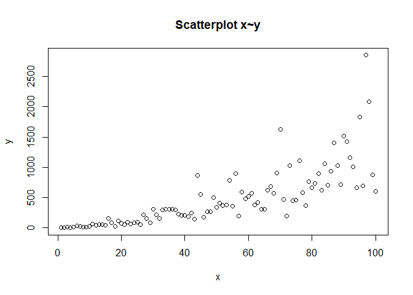
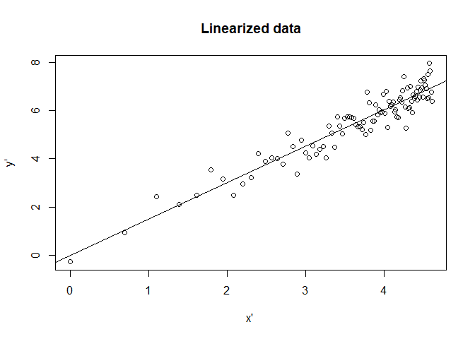

Variables transformation to linearize the model
================
Minah Ramandrosoa
2024-06

One of the key assumptions of linear regression is that there is a
linear relationship between the independent and dependent variables.
Linear models are preferred for their mathematical simplicity,
computational efficient and reduced risk of overfitting.

However, when the relationship between the variables is not linear,
certain transformations can be applied to better capture the underlying
pattern.

To determine the nature of the relationship between the variables, we
can start by visualizing a scatter plot of the data.

``` r
data<- read.csv("C:/Users/USER/Desktop/IIT/data1.csv")
x<- data$x
y<-data$y
plot(x, y, xlab = "x", ylab = "y", main = "Scatterplot x~y")
```

<!-- -->

Let us perform additional test to confirm the non linearity.

- The Rainbow Test compares the fit of a model on the entire dataset
  versus a subsample. If the model fits the subsample better, it implies
  that the relationship between the independent and dependent variables
  is more linear within the restricted range of the subsample, but
  non-linear over the entire range of the data. The t-statistic measures
  the difference between these fits. A high t-statistic (exceeding the
  critical value) suggests potential non-linearity in the overall data.

- The Harvey Collier Test involves conducting a t-test on the recursive
  residuals. This test checks whether the average of the recursive
  residuals deviates significantly from 0. If the actual relationship
  follows a convex or concave pattern, the mean of these residuals will
  show a significant difference form 0. Then a high t-statistic (higher
  than the critical value) suggests non linearity.

The null hypothesis assumes the linearity in the relationship.

Additionally, the decision procedure can be based on the p-value :

- p-value \< $\alpha$ (=0.05), reject the null hypothesis $H_0 :$
  linearity between the variables
- p-value \> $\alpha$ (=0.05), do not reject the null hypothesis $H_0 :$
  linearity between the variables

``` r
  #Perform additional test to confirm the non linearity
library(lmtest)
model <- lm(y~x)
raintest(model)
```

    ## 
    ##  Rainbow test
    ## 
    ## data:  model
    ## Rain = 2.5348, df1 = 50, df2 = 48, p-value = 0.0007587

``` r
harvtest(model)
```

    ## 
    ##  Harvey-Collier test
    ## 
    ## data:  model
    ## HC = 2.0212, df = 97, p-value = 0.04601

Since the p-values from both the Rainbow test and the Harvey-Collier
test are below the 0.05 significance level, we reject the null
hypothesis. Therefore, we conclude that the relationship between the
variables is non-linear.

We are going to compare this plot with those common linearizable models
:

- Quadratic

- Exponential

- Logarithmic

A random noise will be added to simulate real-world data.

The ‘rnorm’ function will random values from a normal distribution with
a mean of 0 and a standard deviation of 0.5.

The function ‘exp()’ will ensure that these random values are positive.

We initialize the value of x from 0 to 100 such as the x on the plot
below.

``` r
par(mfrow = c(2,2))
  #Quadratic 
set.seed(123)
x_quadratic <- 1:100
y_quadratic <- x_quadratic^2 * exp(rnorm(100,sd = 0.5))
plot(x = x_quadratic, y = y_quadratic, main = "Quadratic relationship")

#Exponential
set.seed(123)
x_exp  <- 1:100
y_exp <- exp(x_exp) * exp(rnorm(100,sd = 0.5))
plot(x = x_exp, y = y_exp, main = "Exponential relationship")

  #Logarithmic
set.seed(123)
x_log <- 1:100
y_log <- log(x) * exp(rnorm(100,sd = 0.5))
plot(x = x_log, y = y_log, main = "Logarithmic relationship")
```

<!-- -->

The relationship between the variables of our current data set looks
more like a quadratic function.

This relationship can be expressed as follow : $y = \beta_0x^{\beta_1}$

This functional form is linearizable since :

$\log(y) = \log(\beta_0) + \beta_1 \log(x)$

Then, in order to get linearity, we apply the following transformation
on $y$ and $x$

$$
y' = \log(y)
$$

and

$$
x' = \log(x)
$$

``` r
  #Set up a new model with the transformed variables and visualize the new plot
x_prime <- log(x)
y_prime <- log(y)
model_lin <- lm(y_prime ~ x_prime)

plot(x_prime, y_prime, xlab = "x' ", ylab = "y'", main = "Linearized data")
abline(a = coef(model_lin)["(Intercept)"], b = coef(model_lin)["x_prime"])
```

<!-- -->

The data fit in a straight line.

``` r
cat ("The parameter B0 of the linear regression model is:", coef(model_lin)["(Intercept)"],"\n" )
```

    ## The parameter B0 of the linear regression model is: -0.02006289

``` r
cat ( "The parameter B1 of the linear regression model is :" ,coef(model_lin)["x_prime"])
```

    ## The parameter B1 of the linear regression model is : 1.517943

Given that $\beta_1 = 1.517$ and the original relationship between x and
y was characterized by a power relationship, we can express this
relationship as $y=x^{1.517}$

Let us perform additional tests to confirm the linearity between the
transformed variables

``` r
library(lmtest)
raintest(model_lin)
```

    ## 
    ##  Rainbow test
    ## 
    ## data:  model_lin
    ## Rain = 0.88664, df1 = 50, df2 = 48, p-value = 0.6631

``` r
harvtest(model_lin)
```

    ## 
    ##  Harvey-Collier test
    ## 
    ## data:  model_lin
    ## HC = 0.31612, df = 97, p-value = 0.7526

Since the p-value from both tests exceed the significance level of 0.05,
we fail to reject the Null Hypothesis, indicating a linear relationship
between the transformed dependent and the independent variables.

Consequently, this transformation effectively address the non-linearity
between the original variables $x$ and $y$.
