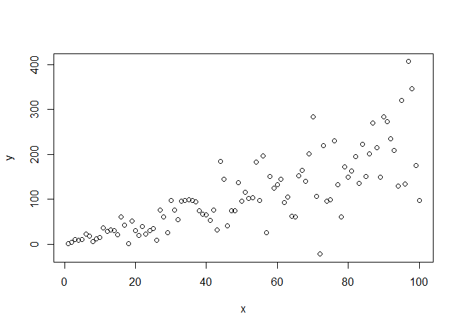

Weighted Least Squares
================
Minah Ramandrosoa
2024-06

In linear regression, having a constant variance of the error terms
$\varepsilon_i$ (homoscedasticity) is essential to ensure the validity
of statistical inference, maintain the accuracy of predictions and
correctly interpret the results of the model

The Weighted Least Squares is an alternative of the Ordinary Least
Squares in order to address the non-constant variance of the error
terms(heteroscedasticity).

Consider the following simple linear regression model taking a sample of
n data points $(x_i,y_i)$ :

<<<<<<< HEAD:R file/Weighted-Least-Squares.md
$y_i = \beta_0 + \beta_1x_i + \varepsilon_i$ ,
$\varepsilon_i \sim N(0,xi\sigma^{2})$
=======
$y_i = \beta_0 + \beta_1x_i + \varepsilon_i$ , $\varepsilon_i \sim N(0,x_i\sigma^{2})$
>>>>>>> 0ff8caccabcb85fdbf85d343f5cfa56ea695af70:Weighted-Least-Squares.md

A priori, the variance of the residuals increased with the regressors.

Then, $Var(y_i) = Var(\varepsilon_i) = x_i\sigma^{2}$

***However, the relationship between the independent variable and the
variance of the residuals is not always as straightforward.***

Consider $X$ as the transformation applied on the residuals, then we
have :

$Var(\varepsilon_i') = Var(X\varepsilon_i)$

Applying the scaling of the variance upon multiplication with a
constant, where $X$ is the constant :

$Var(X\varepsilon_i) = X^{2}Var(\varepsilon_i)$

$Var(X\varepsilon_i) = X^{2}x_i\sigma^{2}$

As we want to get a constant variance, we will be looking for a
transformation that will delete $x_i$,

then,

$$
X^{2} = \frac{1}{x_i} 
$$

and

$$
X = \frac{1}{\sqrt{x_i}}
$$

$Var(X\varepsilon_i) = (\frac{1}{x_i})x_i\sigma^{2}$

$Var(\varepsilon_i') = Var(X\varepsilon_i) = \sigma^{2}$

To stabilize the variance, we let :

$$
\varepsilon_i' = X\varepsilon_i = \frac{\varepsilon_i}{{\sqrt{{x_i}}}} ~ N(0,\sigma^{2}), i = 1,...,n
$$

Recall the original model :

$y_i = \beta_0 + \beta_1x_i + \varepsilon_i$

We rewrite it as follow :

$\frac{y_i}{\sqrt{{x_i}}}$ = $\beta_0(\frac{1}{{\sqrt{x_i}}} )$ +
$\beta_1x_i(\frac{1}{{\sqrt{x_i}}} )$+ $\varepsilon_i'$

$\frac{y_i}{\sqrt{{x_i}}}$ = $\beta_0(\frac{1}{{\sqrt{x_i}}} )$ +
$\beta_1{\sqrt{x_i}}$+ $\varepsilon_i'$

The sum of the weighted errors are given by :

$$
\Sigma_{i=1}^{n} (\varepsilon_i')^{2} =  \Sigma_{i=1}^{n}(\frac{y_i}{\sqrt{{x_i}}}-\beta_0(\frac{1}{{\sqrt{x_i}}} )-\beta_1{\sqrt{x_i}} )^{2}
$$

$$
\Sigma_{i=1}^{n} (\varepsilon_i')^{2} = \Sigma_{i=1}^{n} (\frac{1}{x_i}) (y_i-\beta_o -\beta_1x_i)^2
$$

We get the following weighted least squares function which we will
minimize :

$$
S(\beta_0, \beta_1) =\Sigma_{i=1}^{n} (\frac{1}{x_i})(y_i-\beta_o -\beta_1x_i)^2
$$

In this simple linear regression, the weight that stabilizes the
variance of the residuals is denoted as $wi = \frac{1}{x_i}$.

Notice that a high value of $x_i$ implies a low weight, while the spread
of the residuals increases with the regressor $x_i$. This means that :

- observations with higher variance result in lower weight
- observations with lower variance result in higher weight

In this context, we can conclude that the weights are inversely related
to the variance. Then we get $w_i = \frac{1}{\sigma^2}$.

``` r
data_WLS <- read.csv("C:/Users/USER/Desktop/IIT/data_WLS.csv")
x<-data_WLS$x
y<-data_WLS$y

model_OLS <- lm(y~x)
plot(x,y)
```

<!-- -->

This plot clearly indicates that the higher the value of x, the wider
the spread of y.

Let us perform a Breusch-Pagan test to check the heteroscedasticity. The
null hypothesis states that the variance of errors is constant,
indicating homoscedasticity.

``` r
library(lmtest)
bptest(model_OLS)
```

    ## 
    ##  studentized Breusch-Pagan test
    ## 
    ## data:  model_OLS
    ## BP = 18.864, df = 1, p-value = 1.404e-05

Since the p-value is lower than the significance level of 0.05, we
reject the null hypothesis of homoscedasticity. This indicates that the
variance of the residuals is not constant.

To address heteroscedasticity, we will implement a new model using
weights to correct for the non-constant variance.

For instance, $w_i = \frac{1}{x_i}$

``` r
w<- 1/(x)
  #implement a new model
model_WLS<- lm(y~x, weights = w ) 
  #perform Breusch-Pagan test
bptest(model_WLS)
```

    ## 
    ##  studentized Breusch-Pagan test
    ## 
    ## data:  model_WLS
    ## BP = 0.37267, df = 1, p-value = 0.5416

Since the p-value is now greater than the significance level of 0.05, we
fail to reject the null hypothesis of homoscedasticity. This suggests
that there is no strong evidence to conclude that the variance of the
residuals is non-constant.

This result indicates that the weighting we have implemented effectively
addresses any initial heteroscedasticity observed in the model,
supporting the assumption of constant variance in the residuals.
