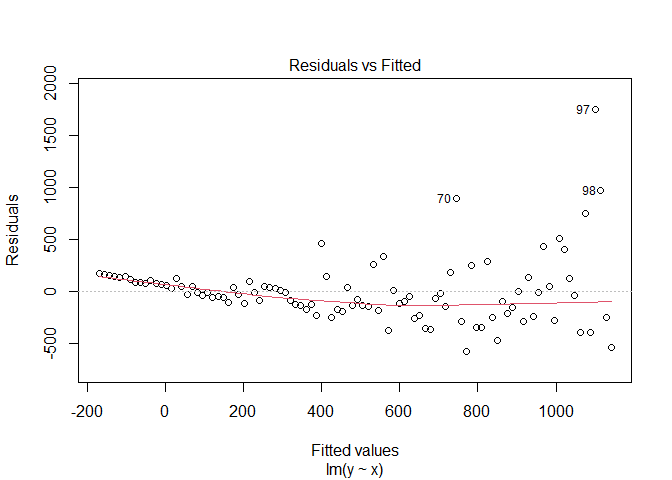
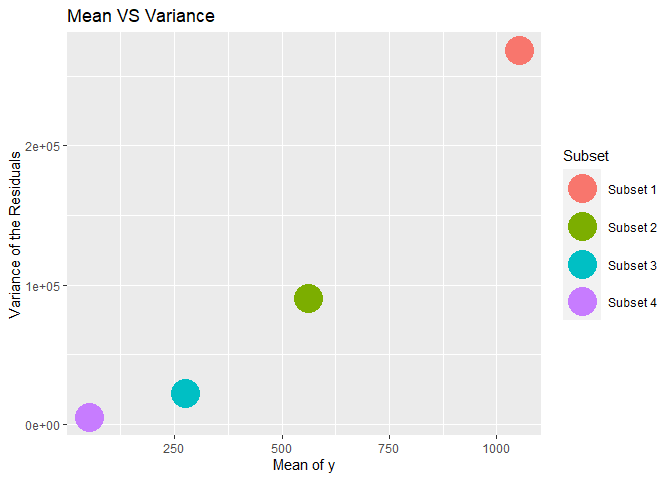
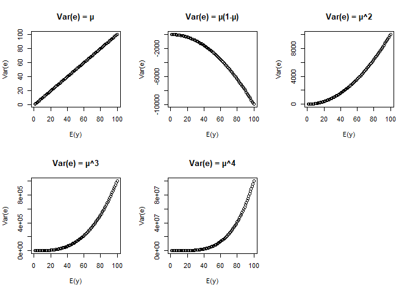

Variance Stabilizing
================

The variance stabilizing transformation is one way to remediate to the
heteroscedasticity.

This transformation is applied on the response variable $y$ in order to
get a constant variance of the residuals.

Given the mean $E(y) = µ$ and the variance $Var(y)$ , an existing
relation $g()$ between the variance and the mean can be denoted as
follow :

$$
Var(y) = g(E(y)) = g(µ)
$$

While $y = µ+e$ with $e$ as the error term and $E(e) = 0$ , the
estimation of the variance of the residuals is as follow :

$$
Var(y)= Var(µ+e) = Var(µ)+Var(e)
$$

The mean $µ$ is a constant, then $Var(µ) = 0$ . Thus,

$$
Var(y) = Var(e) 
$$

$$
Var(e) = g(µ)
$$

The appropriate transformation $h()$ is applied on $y$ by considering
the function $g()$ which defines the dependence of the variance $Var(e)$
to the mean $µ$.

**In order to find the function $h()$, we are going to approximate it by
using the first order of the Taylor series around the mean** $µ$.

**The Taylor series is a powerful tool for approximating functions near a
point.**

Given the Taylor expansion centered at $µ$:

$$
h(y) = h(µ+e) = h(µ)+ \frac{h'(µ)(µ+e-µ)}{1!} +\frac{h''(µ)(µ+e-µ)^2}{2!} + \frac{h'''(µ)(µ+e-µ)^3}{3!} +...
$$

Then, the first order of the Taylor series is:

$$
h(y) = h(µ+e) \approx h(µ)+ eh'(µ)
$$

With $E(e) = 0$ , the expected value of $h(y)$ is given by:

$$
E(h(y)) \approx  E(h(µ)) + E(eh'(µ)) 
$$

$$
E(h(y)) \approx  E(h(µ)) + (E(e)) (E(h'(µ))
$$

$$
E(h(y)) \approx  E(h(µ))
$$

$µ$ is a constant , then $E(h(µ)) = h(µ)$ , thus :

$$
E(h(y))\approx h(µ)
$$

**The function $h$ is a transformation that will make the variance
$Var(h(y))$ approximately constant.**

Then, let us approximate the $Var(h(y))$

Recall

$$
h(y) \approx h(µ) +eh'(µ)
$$

The variance $Var(h(y))$ is given by :

$$
Var(h(y)) \approx Var(h(µ)) + Var(eh'(µ))
$$

As we know $h(µ)$ is a constant, then $Var(h(µ))$ = 0. Applying the
scaling property of the variance when multiplied by a constant (in this
case, $h'(µ)$ is the constant), we get :

$$
Var(h(y)) \approx [h'(µ)]^2Var(e)
$$

$$
Var(h(y)) \approx [h'(µ)]^2 g(µ)
$$

We can solve $[h'(µ)]^2 g(µ)$ = 1 in order to get $Var(h(y))$
approximately constant , that is :

$$
h'(µ) \approx \sqrt{\frac{1}{g(µ)}}
$$

Recall $E(h(y)) \approx h(µ)$ and by taking the anti-derivative of
$h'(µ)$ , we get :

$$
E(h(y)) \approx h(µ) \approx \int \sqrt{\frac{1}{g(µ)}}dµ
$$

***Here are some functions*** $h()$ ***applied on*** $y$ ***depending on the common
relationships*** $g()$ ***between the variance and the mean:***

**1. $g(µ) = µ$**

$$
h(µ) \approx \int \sqrt{\frac{1}{µ}} dµ = \sqrt{µ} 
$$

$$
h(y) \approx \sqrt{y}
$$

**2. $g(µ) = µ(1-µ)$**

$$
h(µ) \approx \int \sqrt{\frac{1}{µ(1-µ)}} dµ = sin^{-1}\sqrt{µ} 
$$

$$
h(y) \approx sin^{-1}\sqrt{y}
$$

**3. $g(µ) = µ^2$**

$$
h(µ) \approx \int \sqrt{\frac{1}{µ^2}}dµ = ln(µ) 
$$

$$
h(y) \approx ln(y)
$$

**4. $g(µ) = µ^3$**

$$
h(µ) \approx \int \sqrt{\frac{1}{µ^3}}dµ = µ^{-1/2} 
$$

$$
h(y) \approx  y^{-1/2}
$$

**5. $g(µ) = µ^4$**

$$
h(µ) \approx \int \sqrt{\frac{1}{µ^4}}dµ = µ^{-1} 
$$

$$
h(y) \approx  y^{-1}
$$

## Application

Let us load the data set, implement a model and perform a model
diagnostic to check out if there is a violation of the homoscedasticity
.

``` r
data1 <- read.csv("C:/Users/USER/Desktop/IIT/Dataset/R/data1.csv")
```

``` r
x <- data1$x
y <- data1$y

  #implement a linear regression model
model = lm(y~x)
```

``` r
  #diagnostic plot 
plot(model, which = 1)
```

<!-- -->

The residuals follow a funnel pattern which suggests that its spread
increases with the fitted values. We can conclude that the variance of
the residuals is not constant, then there is heteroscedasticity.

The Breusch-Pagan test can help to confirm that.

``` r
library(lmtest)
```

``` r
bptest(model)
```

    ## 
    ##  studentized Breusch-Pagan test
    ## 
    ## data:  model
    ## BP = 10.899, df = 1, p-value = 0.0009622

Breusch-Pagan test evaluates whether the variance of the residuals has
any dependency on the regressors. If there is a relationship between the
variance and the regressors, it suggests a non-constant variance or
heteroscedasticity.

The null hypothesis is homoscedasticity. Since the p-value is less than
the significance level of 0.05, we reject the null hypothesis. For
instance, homoscedasticity is not upheld, thus the variance is not
constant.

## Variance stabilizing

In order get a constant variance, we are going to apply the appropriate
transformation on y. To do this, we have to figure out the relationship
between the variance of the residuals and the expected value of y.

We are going to subdivide the whole data into 4 groups in order to
identify patterns or differences in variability between various groups.

``` r
library(ggplot2)
library(tidyverse)
library(dplyr)
library(modelr)
```

``` r
  #Add residuals
data1 <-data1 %>% 
  add_residuals(model)

head(data1)
```

    ##   x         y    resid
    ## 1 1  0.755604 171.6467
    ## 2 2  2.520940 160.1563
    ## 3 3 11.327944 155.7076
    ## 4 4  8.287064 139.4109
    ## 5 5 11.926952 129.7951
    ## 6 6 34.645633 139.2580

``` r
  #Variance and mean in different subset observation 
subset_1 <- data1 %>% 
  filter(x>75)
variance_1 <- var(subset_1$resid)
mean_1 <- mean(subset_1$y)

subset_2<- data1 %>% 
  filter(50 < x & x <= 75)
variance_2<- var(subset_2$resid)
mean_2 <- mean(subset_2$y)

subset_3 <- data1 %>% 
  filter(25 < x & x <= 50)
variance_3 <- var(subset_3$resid)
mean_3 <- mean(subset_3$y)

subset_4 <- data1 %>% 
  filter(x <= 25)
variance_4 <- var(subset_4$resid)
mean_4 <- mean(subset_4$y)

subset_mean <- c(mean_1,mean_2, mean_3, mean_4)
subset_var <- c(variance_1, variance_2, variance_3, variance_4)

subset_summary <- data.frame(
  Subset = c("Subset 1", "Subset 2", "Subset 3", "Subset 4"),
  Mean = subset_mean, 
  Variance = subset_var)

  #Plot the variance against the mean
ggplot(subset_summary, aes(x = Mean, y = Variance, color = Subset))+
  geom_point(size = 10)+
  labs(x = "Mean of y", y = "Variance of the Residuals", title = "Mean VS Variance")
```

<!-- -->

As we can see the variance tends to increase with the mean of y.

Let us simulate some common functions and visualize them in order to
identify which one best matches the relationship between the current
variance and mean.

These plots provide a clearer intuition for understanding the variance
and the mean relationship.

``` r
par(mfrow = c(2,3))

  # Var(e) = E(y)
set.seed(123)
x <- 1:100
y1 <- x
plot(x, y1, xlab = "E(y)", ylab = "Var(e)", main = "Var(e) = µ")

# Var(e) = E(y) (1-E(y))
y2 <- x*(1-x)
plot(x, y2, xlab = "E(y)", ylab = "Var(e)", main = "Var(e) = µ(1-µ)")

 # Var(e) = E(y)^2
y3 <- x^2
plot(x, y3, xlab = "E(y)", ylab = "Var(e)", main = "Var(e) = µ^2")

  #Var(e) = E(y)^3
y4 <- x^3
plot(x, y4, xlab = "E(y)", ylab = "Var(e)", main = "Var(e) = µ^3")

  #Var(e) = E(y)^4
y5 <- x^4
plot(x, y5, xlab = "E(y)", ylab = "Var(e)", main = "Var(e) = µ^4")
```

<!-- -->

We notice that $Var(e) = [E(y)]^2$ and $Var(e) = [E(y)]^3$ and
$Var(e) = [E(y)]^4$ are quite similar to our actual variance and mean
relationship.

**It is important to highlight that the variance-stabilizing
transformation is empirical and is a trial-and-error procedure. Then we
have to figure out which of these cases will remediate to the
heteroscedasticity.**

Here are the transformations that we are going to apply :

- $g(µ) = µ^2$

$$
h(µ) \approx \int \sqrt{\frac{1}{µ^2}}dµ = ln(µ) 
$$

$$
h(y) \approx ln(y)
$$

- $g(µ) = µ^3$

$$
h(µ) \approx \int \sqrt{\frac{1}{µ^3}}dµ = µ^{-1/2} 
$$

$$
h(y) \approx  y^{-1/2}
$$

- $g(µ) = µ^4$

$$
h(µ) =\approx\int \sqrt{\frac{1}{µ^4}}dµ = µ^{-1} \\
$$

$$
h(y) \approx  y^{-1}
$$

``` r
  #Define a function that set up a model for each y transformation
fit_models_with_trans<- function(x,y) {
  y_VST1<- log(y)
  y_VST2<- y^(-1/2)
  y_VST3<- y^(-1)

  y_trans_list <- list(y_VST1, y_VST2, y_VST3)
  trans_labels <- c("log(y)", "y^(-1/2)", "y^(-1)")


  for (i in 1:length(y_trans_list)) {
    
    #Set up the linear regression function
    model_VST <- lm(y_trans_list[[i]]~x)

    
    #Perform Breusch Pagan Test 
    bptest_VST <- bptest(model_VST)
    
    cat("Breusch-Pagan test results for transformation :", trans_labels[i], "\n")
    print(bptest_VST)
    cat("\n")}
}

fit_models_with_trans(x,y)
```

    ## Breusch-Pagan test results for transformation : log(y) 
    ## 
    ##  studentized Breusch-Pagan test
    ## 
    ## data:  model_VST
    ## BP = 6.6277, df = 1, p-value = 0.01004
    ## 
    ## 
    ## Breusch-Pagan test results for transformation : y^(-1/2) 
    ## 
    ##  studentized Breusch-Pagan test
    ## 
    ## data:  model_VST
    ## BP = 4.6134, df = 1, p-value = 0.03172
    ## 
    ## 
    ## Breusch-Pagan test results for transformation : y^(-1) 
    ## 
    ##  studentized Breusch-Pagan test
    ## 
    ## data:  model_VST
    ## BP = 3.4849, df = 1, p-value = 0.06193

Since $h(y) \approx y^{-1}$  ,the p-value exceeds the significance level
of 0.05, indicating with 95% confidence that the variance is constant.

We fail to reject the Null Hypothesis, providing sufficient evidence for
homoscedasticity.

Therefore, the relationship between the variance and the mean can be
denoted as $Var(e) \approx [E(y)]^4$ so the transformation applied on
the dependent variable y, which stabilizes the variance of the
residuals, is $y'\approx y^{-1}$ .
