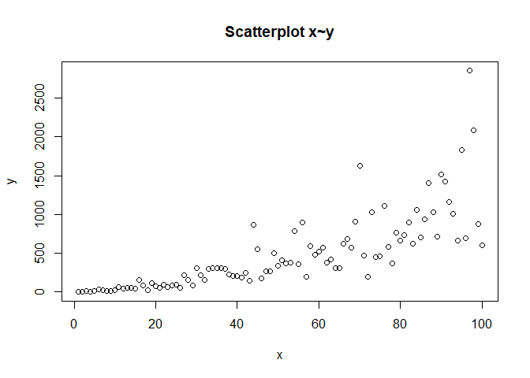
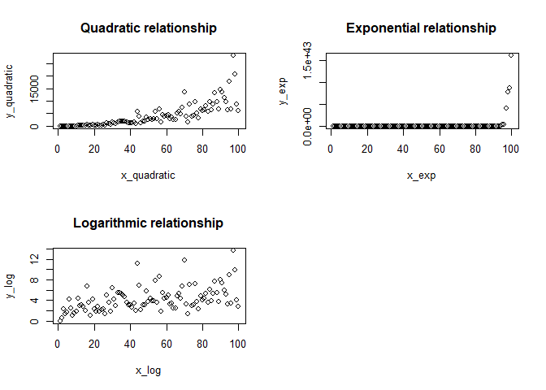
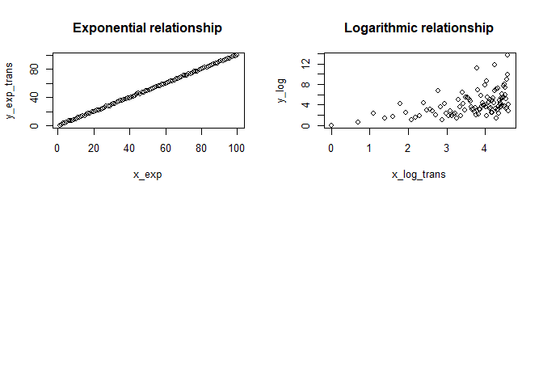

Transformation to linearize
================
Minah Ramandrosoa
2024-06

## TRANSFORMATIONS TO LINEARIZE THE MODEL

One of the key assumptions of linear regression is that there is a
linear relationship between the independent and dependent variables.
Linear models are preferred for their mathematical simplicity,
computational efficient and reduced risk of overfitting.

However, when the relationship between the variables is not linear,
certain transformations can be applied to better capture the underlying
pattern.

To determine the nature of the relationship between the variables, we
can start by visualizing a scatter plot of the data.

``` r
data<- read.csv("C:/Users/USER/Desktop/IIT/data1.csv")
x<- data$x
y<-data$y
plot(x, y, xlab = "x", ylab = "y", main = "Scatterplot x~y")
```

<!-- -->

We are going to compare this plot with those common linearizable models
:

- Quadratic

- Exponential

- Logarithmic

A random noise will be added to simulate real-world data.

The ‘rnorm’ function will random values from a normal distribution with
a mean of 0 and a standard deviation of 0.5.

The function ‘exp()’ will ensure that these random values are positive.

We initialize the value of $x$ from 0 to 100 such as the $x$ variable of the initial data set. 

``` r
par(mfrow = c(2,2))
  #Quadratic 
set.seed(123)
x_quadratic <- 1:100
y_quadratic <- x_quadratic^2 * exp(rnorm(100,sd = 0.5))
plot(x = x_quadratic, y = y_quadratic, main = "Quadratic relationship")

#Exponential
set.seed(123)
x_exp  <- 1:100
y_exp <- exp(x_exp) * exp(rnorm(100,sd = 0.5))
plot(x = x_exp, y = y_exp, main = "Exponential relationship")

  #Logarithmic
set.seed(123)
x_log <- 1:100
y_log <- log(x) * exp(rnorm(100,sd = 0.5))
plot(x = x_log, y = y_log, main = "Logarithmic relationship")
```

<!-- -->

The relationship between the variables of our current data set looks
more like a quadratic function.

This relationship ca be expressed as follow $y = B_0x^{B_1}$

This functional form is linearizable since :

$\log(y) = \log(B_0) + B_1 \log(x)$

Then , $y' = \log(y)$

And, $x' = \log(x)$

``` r
  #Set up a new model with the transformed variables and visualize the new plot
x_prime <- log(x)
y_prime <- log(y)
model_lin <- lm(y_prime ~ x_prime)

plot(x_prime, y_prime, xlab = "x' ", ylab = "y'", main = "Linearized data")
abline(a = coef(model_lin)["(Intercept)"], b = coef(model_lin)["x_prime"])
```

<!-- -->

The data fit in a straight line.

``` r
cat ("The parameter B0 of the linear regression model is:", coef(model_lin)["(Intercept)"],"\n" )
```

    ## The parameter B0 of the linear regression model is: -0.02006289

``` r
cat ( "The parameter B1 of the linear regression model is :" ,coef(model_lin)["x_prime"])
```

    ## The parameter B1 of the linear regression model is : 1.517943

Given that $B_1 = 1.517$ and the original relationship between x and y
was characterized by a power relationship, we can express this
relationship as $y=x^{1.517}$

Let us perform additional tests (Rainbow and Harvey-Collier test) to confirm the linearity between the
transformed variables

``` r
library(lmtest)
raintest(model_lin)
```

    ## 
    ##  Rainbow test
    ## 
    ## data:  model_lin
    ## Rain = 0.88664, df1 = 50, df2 = 48, p-value = 0.6631

``` r
harvtest(model_lin)
```

    ## 
    ##  Harvey-Collier test
    ## 
    ## data:  model_lin
    ## HC = 0.31612, df = 97, p-value = 0.7526

Since the p-value from both tests exceed the significance level of 0.05,
we fail to reject the Null Hypothesis, indicating a linear relationship
between the dependent and the independent variables.

Consequently, this transformation effectively address the non-linearity
between the original variables x and y.

We can perform the transformation on the logarithmic and exponential
relationship as follow :

- The exponential relationship $y = B_0 e^{(B_1x)}$ is linearizable
  since $ln(y) = ln(B_0) + B_1x$, then $y' = ln(y)$

- The logarithmic relationship $y=B_0+B_1log(x)$ is linearizable since
  $y = B_0 + B_1log(x)$ , then , $x' = log(x)$

``` r
par(mfrow =c(2,2))
  #Transformation of the exponential function
y_exp_trans <-log(y_exp)
plot(x = x_exp, y = y_exp_trans, main = "Exponential relationship")

  #Transformation of the logarithmic function 
x_log_trans <- log(x_log)
plot(x = x_log_trans, y = y_log, main = "Logarithmic relationship")
```

<!-- -->

``` r
  #Perform additional test 
model_exp<- lm(y_exp_trans~x_exp)
model_log<- lm(y_log~x_log_trans) 


raintest(model_exp)
```

    ## 
    ##  Rainbow test
    ## 
    ## data:  model_exp
    ## Rain = 0.88229, df1 = 50, df2 = 48, p-value = 0.6693

``` r
harvtest(model_exp)
```

    ## 
    ##  Harvey-Collier test
    ## 
    ## data:  model_exp
    ## HC = 0.58492, df = 97, p-value = 0.56

``` r
raintest(model_log)
```

    ## 
    ##  Rainbow test
    ## 
    ## data:  model_log
    ## Rain = 0.84955, df1 = 50, df2 = 48, p-value = 0.7155

``` r
harvtest(model_log)
```

    ## 
    ##  Harvey-Collier test
    ## 
    ## data:  model_log
    ## HC = 0.76422, df = 97, p-value = 0.4466

Since the p-value from all the tests below exceed the significance level
of 0.05, we fail to reject the Null Hypothesis, indicating a linear
relationship between the transformed dependent and the independent
variables.
