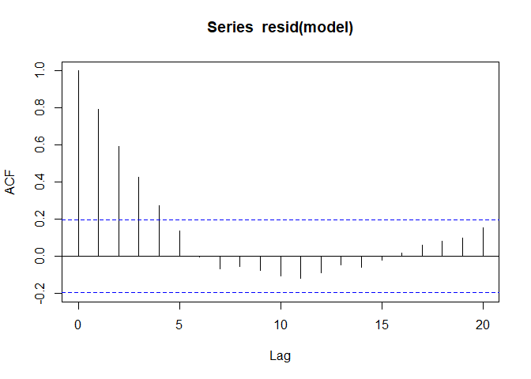
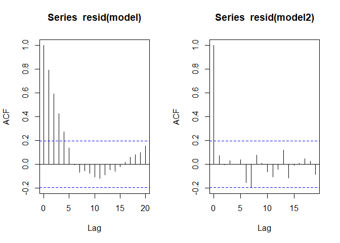

AUTOCORRELATION
================
Minah Ramandrosoa
2024-06

In linear regression, correlated error terms can introduce bias and
inconsistency into the Ordinary Least Squares estimates of the
regression coefficients, thereby comprimising predictive performance of
the model.

Autocorrelation occurs when the errors terms $E_i$ and $E_j$ are
correlated, expressed by $Cov(E_i, E_j)\neq 0$

Correlated error terms often follow a first order autoregressive process
AR(1):

$$
E_i = \phi E_{i-1} + A_i , A_i \sim N(0,\sigma^2)
$$

$\phi$ is an unknown parameter that defines the relationship between
successive model errors $E_i$ and $E_{i-1}$. It can be estimated using
the Ordinary Least Squares method.

$A_i$ is a random variable normally and independently distributed.

Given the simple linear regression model with first-order autoregressive
errors :

$y_i = B_0 + B_1x_i + Ei$ where the error terms can be expressed as
follow : $E_i = \phi E_{i-1} + A_i$

$y_i$ and $x_i$ are the observed values of the response and predictor
variables at time $i$

To detect the presence of autocorrelation in a linear regression model,
we can deploy a Durbin-Watson (DW) test. It tests for first order serial
correlation, which means it checks whether the residuals are correlated
with each other across time.

The correlation coefficient between of $E_i$ and $E_{i-1}$ is given by:

$$
Corr(E_i, E_{i-1}) = \frac{Cov(E_{i-1}, E_i)} {\sqrt{Var(E_i)}\sqrt{Var(E_{i-1}})}
$$

Assume the stationarity process where the mean and variance of the error
term are constant over time, then $$
Var(E_{i-1}) = Var(E_i) = Var(E_{i+1}) = ... 
$$

Recall $E_i = \phi E_{i-1} + A_i$ where $A_i$~$N(0,\sigma^2)$

We can rewrite $Var(Ei) = Var(\phi E_{i-1} + A_i)$

The variances $Var(\phi E_{i-1})$ and $Var(A_i)$ are independent so they
are additive.By applying the scaling property of the variance when
multiplied by a constant ($\phi$ is the constant), we get:

$Var(Ei) = \phi^2Var(E_{i-1}) + Var(A_i)$

$Var(Ei) = \phi^2Var(E_i) + \sigma^2$

$$
Var(Ei) = \frac{\sigma^2} {(1-\phi^2)}
$$

While $Cov(E_{i-1}, E_i) = Cov(E_{i-1}, \phi E_{i-1}+A_i,)$

Applying the linearity of covariance :

$Cov(E_{i-1}, E_i) = Cov(\phi E_{i-1}, E_{i-1})+ Cov(A_i, E_{i-1})$

$Cov(E_{i-1}, E_i) = \phi Cov(E_{i-1}, E_{i-1})+ Cov(A_i, E_{i-1})$

As $A_i$ are noise , the $Cov(A_i, E_{i-1})$ =0

$Cov(E_{i-1}, E_i) = \phi Cov(E_{i-1}, E_{i-1})$

$Cov(E_{i-1}, E_i) = \phi Var(E_{i-1})$

Recall $Var(E_{i-1}) = Var(E_i) = \frac {\sigma^2}{(1-\phi^2)}$

Then

$$
Cov(E_{i-1}, E_i) = \phi \frac{\sigma^2} {(1-\phi^2)}
$$

Recall,

$$
Corr(E_i, E{i-1}) = \frac{Cov(E_{i-1}, E_i)} {\sqrt{Var(E_i)}\sqrt{Var(E_{i-1}})}
$$

$$
\text{Corr}(E_i, E_{i-1}) = \frac{\phi \frac{\sigma^2}{1-\phi^2}}{\sqrt{\frac{\sigma^2}{1-\phi^2}} \sqrt{\frac{\sigma^2}{1-\phi^2}}}
$$

$$
Corr(E_i, E_{i-1}) = \phi
$$

The lag k autocorrelation is given by $p_k = \phi^k$ for $k =1,2,...,$
this equation is called the autocorrelation function.

The lag one autocorrelation is given by :

$$
p_1 = Corr(E_i, E_{i-1}) 
$$

$$
p_1= \phi
$$

The Durbin-Watson Test only checks for autocorrelation with a lag of 1.

Given the Durbin-Watson test statistic :

$$
d = \frac{\sum_{i=1}^{n}(E_{i+1}-E_{i})^2}{\sum_{i=1}^{n} E_i^2}
$$

Let us express $d$ as a function of the correlation coefficient $\phi$.

Recall:

$E_{i+1}$ = $\phi E_{i} + A_i$ , $A_i \sim N(0,\sigma^2)$

This relationship resembles a typical linear regression form:

$y_i$ = $B_1 x_{i} + E_i$ , $E_i$ ~$N(0,\sigma^2)$

We can estimate $\phi$ by using the Ordinary Least Squares regression to
approximate the slope :

$$
\hat{\phi}  = \frac{\sum_{i=1}^{n}(E_i - \bar{E})(E_{i+1} - \bar{E})}{\sum_{i=1}^{n}(E_i - \bar{E})^2}
$$

We know that the expected value of the error terms $E_i$ is 0 then :

$$
\hat{\phi} = \frac{\sum_{i=1}^{n} E_iE_{i+1}}{\sum_{i=1}^{n} E_i^2}
$$

The developed form of the Durbin-Watson statistic is as follow :

$$
d = \frac{\sum_{i=1}^{n} (E_{i}^2-2E_iE_{i+1}+E_{i+1}^2)}{\sum_{i=1}^{n} E_i^2}
$$

$$
d = \frac{\sum_{i=1}^{n} (E_{i+1}^2)}{\sum_{i=1}^{n}  E_i^2} + \frac{\sum_{i=1}^{n} (E_{i}^2)}{\sum_{i=1}^{n}  E_i^2} -\frac{\sum_{i=1}^{n} (2E_iE_{i+1})}{\sum_{i=1}^{n}  E_i^2}
$$

For large n , ${\sum_{i=1}^{n} (E_{i+1}^2)}\approx\sum_{i=1}^{n} E_i^2$

Then , we get :

$$
d\approx 2  -\frac{\sum_{i=1}^{n}(2E_iE_{i+1})}{\sum_{i=1}^{n} E_i^2} 
$$

$$
d\approx 2(1-\frac{\sum_{i=1}^{n} E_iE_{i+1}}{\sum_{i=1}^{n} E_i^2})
$$

$$
d\approx 2(1-\hat{\phi})
$$

When $d$ tends to 2, we will have no autocorrelation as
$\hat{\phi} \approx 0$

When $d$ tends to 0, hence $\hat{\phi} \approx 1$, we will have a
perfect autocorrelation.

Instead of using a precise critical value for $d$, the decision
procedure is as follows:

- if $d < d_L$, reject $H_0 : \phi =0$
- if $d > d_U$, do not reject $H_0 : \phi =0$
- if $d_L \leq d \leq d_U$, the test is inconclusive

We need to refer to statistical tables to determine the critical values
$d_U$ and $d_L$ because they depend on the sample size (n) and the
number of regressors (k) in the model.

To detect negative correlation, we consider values of $d$ greater than
2, as negative correlation corresponds to $d$ values above 2.

- if $d > 4-d_L$, do not reject $H_0 : \phi =0$
- if $d < 4-d_U$, reject $H_0 : \phi =0$
- if $4-d_U \leq d \leq 4-d_L$, the test is inconclusive.

Additionally, we can use the p-value to make an inference.

- p-value \< $\alpha$, reject $H_0 : \phi =0$
- p-value \> $\alpha$, do not reject $H_0 : \phi =0$

``` r
data <- read.csv("C:/Users/USER/Desktop/IIT/data_autocorr.csv")
```

``` r
library(lmtest)
```

``` r
  #Perform Durbin-Watson test 
x <- data$x
y <- data$y

model <- lm(y~x)
dwtest(model)
```

    ## 
    ##  Durbin-Watson test
    ## 
    ## data:  model
    ## DW = 0.4116, p-value < 2.2e-16
    ## alternative hypothesis: true autocorrelation is greater than 0

We see that the test statistics is d = 0.4116 which is close to 0,hence
$\phi$ approaches 1, and the p-value is less than the significance level
0.05. Then we reject the null hypothesis $H_0 : \phi$ = 0 and we
conclude that the errors $E_i$ are correlated.

To further investigate, let us examine the ACF plot

``` r
library(tseries)
acf(resid(model))
```

<!-- -->

This plot shows the correlation of the error terms in different lags.
The blue dotted line represents the significance level.

Lag 0 represents the correlation of a residual with itself, then it is
always taken as one.

If there is autocorrelation, the vertical bars would quickly drop to
almost zero or at least between or ear the blue line.

For instance, we can conclude that the residuals are correlated but the
correlation ceases after lag 5.

To address to this autocorrelation issue, we will to perform an
appropriate transformation of variables.

Recall $y_i$ and $x_i$ are the observations of the response and
predictor variables at time $i$, let us define new variables $y'$ and
$x'$ as follows :

$$
y_i' = y_i - \phi y_{i-1}
$$ $$
x_i' = x_i - \phi x_{i-1}
$$

We will demonstrate how these transformations lead to a new model with
uncorrelated residuals.

Starting with the initial linear regressio model :

$y_i = B_0 + B_1 x_i + E_i$ and $E_i = \phi E_{i-1} + A_i$ , where $A_i$
~NID(0, $\sigma^2$ )

By substituting :

$y_i' = y_i - \phi y_{i-1}$

$y_i' = (B_0 + B_1x_i +E_i) - \phi(B_0 + B_1x_{i-1} +E_{i-1})$

$y_i' = B_0 (1-\phi) + B_1(x_i -\phi x_{i-1}) + E_i-\phi E{i-1}$

Thus,

$$
y_i' = B_0 (1-\phi) + B_1x_i' + A_i
$$ Here, $A_i$ represents residuals that are uncorrelated and exhibit
constant variance (white noise).

Additionally, $B_0' = B_0 (1-\phi)$ represents the transformed y
intercept, enhancing the model’s performance.

$\phi$ will be approximated by using $p_1 = corr(E_i, E{i-1})$

``` r
par(mfrow=c(1,2))
  #extract and compute the ACF of the residuals
rho = acf(resid(model))

  #Extract the ACF value at lag 1
r = rho[1]$acf[1,,]

n = length(model$residuals)

  #Transform the dependent and the independent variables 
y_prime = rep(0,n-1)
x_prime = rep(0,n-1)

for (i in 1:n-1){
  y_prime[i] = data$y[i+1]-r*data$y[i]
  x_prime[i] = data$x[i+1]-r*data$x[i]
}

model2<- lm(y_prime~x_prime)

acf(resid(model2))
```

<!-- -->

We set up Model 2 using the transformed dependent and independent
variables. From the ACF plot, we observe that the correlation drops
directly to 0 at lag 1 when using the transformed variables. This
suggests that the residuals are no more correlated to each other.

Let us perform a Durbin-Watson test to confirm that.

``` r
dwtest(model2)
```

    ## 
    ##  Durbin-Watson test
    ## 
    ## data:  model2
    ## DW = 1.8505, p-value = 0.1976
    ## alternative hypothesis: true autocorrelation is greater than 0

The test statistic d is now closer to 2, which suggests a correlation
coefficient $\phi \approx 0$. In addition, the p-value is greater than
the significance level of 0.05,then we fail to reject the null
hypothesis $H_0 : \phi$ = 0 and we conclude that the errors $E_i$ are
not correlated.
